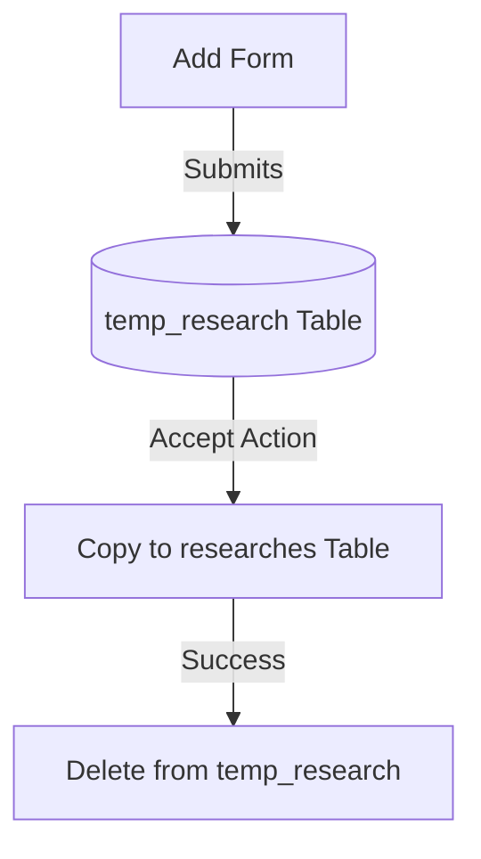

# RESEARCH APPROVAL WORKFLOW TUTORIAL
---

> This tutorial document details the step-by-step implementation of the multi-stage approval system. 
> All new submissions are diverted to a staging area for review before being finalized.

---

## 📂 STEP 1: DATABASE CONNECTIVITY
**Purpose**: To allow the system to fetch data from the `temp_research` table.

### Code Change: `Research/config/Research.php`
- **Location**: Around Line 85.
- **Change**: Added `getTempAll()` method.
- **Purpose**: Creates a specialized function to retrieve "Pending" applications.

#### 📝 Before:
```php
public function getAll()
{
    $stmt = $this->con->prepare('SELECT * FROM researches ORDER BY created_at DESC');
    $stmt->execute();
    return $stmt->fetchAll();
}
```

#### 📝 After:
```php
public function getAll()
{
    $stmt = $this->con->prepare('SELECT * FROM researches ORDER BY id DESC');
    $stmt->execute();
    return $stmt->fetchAll();
}

public function getTempAll()
{
    $stmt = $this->con->prepare('SELECT * FROM temp_research');
    $stmt->execute();
    return $stmt->fetchAll();
}
```

---

## 🖥️ STEP 2: USER INTERFACE INTEGRATION
**Purpose**: To show administrators all data currently waiting for approval.

### Code Change: `tempresearch.php`
- **Location**: Entire File.
- **Change**: Created a table with placeholders for "Accept" and "Decline" buttons.
- **Purpose**: Acts as a component to visualize data from the staging area.

### Code Integration: `Research/index.php`
- **Location**: Top and Bottom of the file.
- **Change**: Added `include "../tempresearch.php";` and the action handler.
- **Purpose**: "Links" the pending component and processes the logic at the top of the page.

#### 📝 Implementation:
```php
<?php
include "config/Research.php";
$research->handleApprovals(); // Added at the top to fix header issues
$data = $research->getAll();
?>
```

---

## 🚀 STEP 3: SUBMISSION STAGING (ADD TO TEMP)
**Purpose**: To ensure all **new** research entries go to the `temp_research` table first.

### Code Change: `Research/config/Research.php`
- **Location**: Around Line 52 (in `Add()` method).
- **Change**: Changed `INSERT INTO researches` to `INSERT INTO temp_research`.
- **Purpose**: Diverts raw submissions to a staging area for review instead of the final database.

#### 📝 Code Logic:
```php
// Redirected target from "researches" to "temp_research"
$stmt = $this->con->prepare("INSERT INTO temp_research (...) VALUES (...)");
```

---

## ✅ STEP 4: THE APPROVAL LOGIC (MOVE TO MAIN)
**Purpose**: Handles the moving of data between tables when the "Accept" button is clicked.

### Code Change: `Research/config/Research.php`
- **Location**: Around Line 131.
- **Change**: Added `handleApprovals()`, `accept()`, and `decline()`.
- **Purpose**: This creates the "brain" for the buttons.

---

## 🛠️ THE CORE LOGIC (HOW IT WORKS)
---

### 1. The Submission Diverter
When a user clicks "Submit" on the Add Research form, the system uses a "Track Switch." Instead of the data going to the final list, the code points it to the **Review Chamber** (`temp_research`).

### 2. The Move-and-Clean Process
When the Admin clicks **Accept**, the backend runs a "Copy and Paste" operation:
1. **FETCH**: System grabs the pending data.
2. **INSERT**: System copies it to the main table.
3. **DELETE**: System wipes the temp table so the pending list doesn't get cluttered.



### 3. The Action Handler
The `handleApprovals()` function at the top of the index page "listens" for button clicks. If it hears a click, it runs the code and refreshes the page so you see the data move instantly without errors.

---

> [!TIP]
> This "Staging Pattern" is used in professional apps to ensure all data is verified before it goes live!
