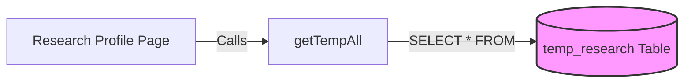
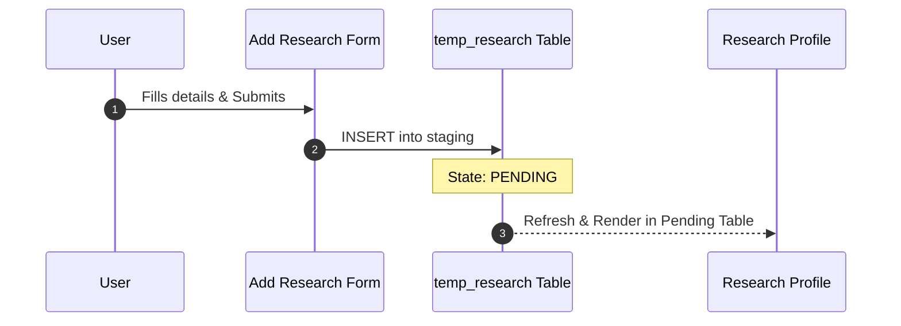

# RESEARCH APPROVAL WORKFLOW TUTORIAL
---

> This tutorial document details the step-by-step implementation of the multi-stage approval system. 
> All new submissions are diverted to a staging area for review before being finalized.

---

## 📂 STEP 1: DATABASE CONNECTIVITY
### Purpose
Enables the application to communicate with the specialized staging table.

### Code Modification: Research.php
- File Path: config/Research.php
- Target Location: Following the getAll() method.

#### 📝 Before:
```php
public function getAll()
{
    $stmt = $this->con->prepare('SELECT * FROM researches ORDER BY created_at DESC');
    $stmt->execute();
    return $stmt->fetchAll();
}
```

#### 📝 After:
```php
public function getAll()
{
    // Updated primary sort to ID
    $stmt = $this->con->prepare('SELECT * FROM researches ORDER BY id DESC');
    $stmt->execute();
    return $stmt->fetchAll();
}

// New method to fetch pending records
public function getTempAll()
{
    $stmt = $this->con->prepare('SELECT * FROM temp_research');
    $stmt->execute();
    return $stmt->fetchAll();
}
```



---

## 🖥️ STEP 2: USER INTERFACE INTEGRATION
### Purpose
Visualizes the pending records on the main dashboard for administrative oversight.

### Component Creation: tempresearch.php
- This standalone component contains the HTML table for pending applications.
- It uses id=pendingTable to maintain independent search and filtering logic.

### Main View Integration: index.php
- File Path: Research/index.php
- Target Location: Page footer section.

#### 📝 After (Added Include):
```php
    <!-- End of Main Research Section -->
    </section>

    <!-- PENDING APPLICATIONS COMPONENT -->
    <?php include "../tempresearch.php"; ?>
</div>
```

---

## 🚀 STEP 3: SUBMISSION STAGING LOGIC
### Purpose
Redirects raw data entry to the review chamber (temp_research) instead of the final database.

### Code Modification: Research.php
- File Path: config/Research.php
- Logic Hook: Add() method.

#### 📝 Before (Direct to Main):
```php
$stmt = $this->con->prepare("INSERT INTO researches (...) VALUES (...)");
```

#### 📝 After (Redirect to Staging):
```php
$stmt = $this->con->prepare("INSERT INTO temp_research (...) VALUES (...)");
```

### 📊 System Architecture Flow


---

> [!NOTE]
> All changes are currently committed to the local and remote repository for safety.
